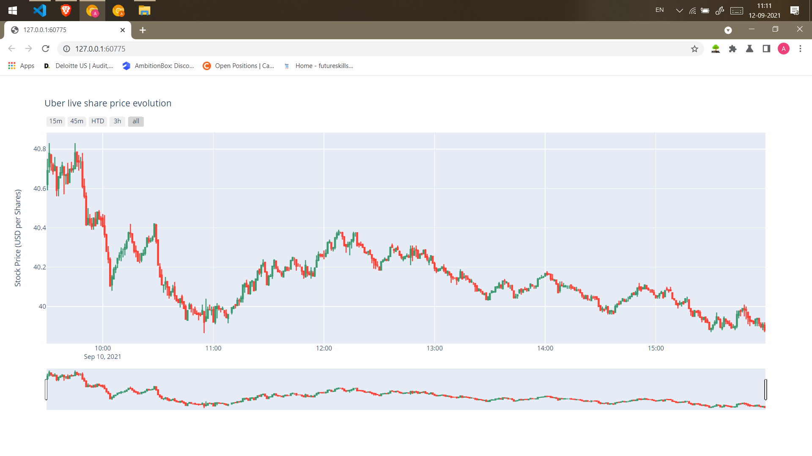

# Uber Finance Tracker

__A python code which shows the Uber live share price evolution with the help of yfinance API provided by python__

## *yfinance* API
Ever since Yahoo! finance decommissioned their historical data API, many programs that relied on it to stop working.

yfinance aims to solve this problem by offering a reliable, threaded, and Pythonic way to download historical market data from Yahoo! finance.
    
https://pypi.org/project/yfinance/

https://finance.yahoo.com/

### Changes you can do!!
__Go to the in *Line number 13* change the *ticker* to the preferded organization. You can change the *period* and *interval* too.__

### Packages used
    
 `pip install numpy `

 `pip install pandas`
 
 `pip install yfinance`
 
 `pip install plotly`

*Graph*

